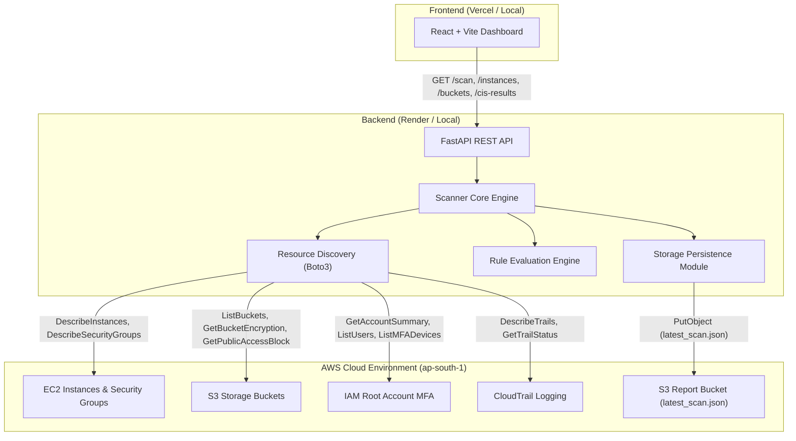

# Cloud Security Posture Management (CSPM) Scanner

A production-grade, lightweight Cloud Security Posture Management (CSPM) application built with **FastAPI**, **Boto3**, and **React (Vite)**. The scanner discovers active AWS cloud resources across EC2, S3, IAM, and CloudTrail, evaluates them against security baseline controls, persists scan results to AWS S3 storage, and presents findings in a dark security operations dashboard.

---

## Architecture & Data Flow



### Data Flow Overview
1. **Trigger / Fetch**: The user initiates a scan via `GET /scan` or accesses resource endpoints (`/instances`, `/buckets`, `/cis-results`).
2. **Discovery Phase**: Boto3 SDK queries AWS APIs for running EC2 instances, security group rules, workload S3 buckets, root MFA configuration, and CloudTrail trails.
3. **Evaluation Phase**: Security check rules evaluate discovered configurations to produce deterministic `PASS` or `FAIL` findings with factual detection details.
4. **Persistence Phase**: If `SCAN_REPORT_BUCKET` is configured, scan results are serialized to JSON and uploaded to AWS S3 as `latest_scan.json`. If in-memory cache is empty on startup, the API retrieves the latest report from S3.
5. **Presentation Phase**: The React frontend renders the Security Posture Dashboard, complete with check metrics, an *Attention Required* failure callout, resource inventories, and a factual finding inspection side drawer.

---

## Key Features

- **Automated AWS Workload Audit**: Evaluates EC2, S3, IAM root credentials, and regional CloudTrail logging.
- **S3 Report Persistence**: Automatically stores audit reports in AWS S3 (`latest_scan.json`) and loads previous scans on startup.
- **Workload Isolation**: Filters out the scanner's own S3 report bucket from target workload discovery to avoid self-audit contamination.
- **Enterprise Dark Console UI**: Built with a security-console aesthetic featuring state-responsive ambient background lighting, metric cards, inventory tables, and accessible keyboard navigation.
- **Factual Inspection Side Drawer**: Side drawer displays check details, affected resource ID, exact detection messages, and neutral explanations without unsupported compliance claims.

---

## Evaluated Security Checks

| Check ID | AWS Service | Control Evaluation Description |
| :--- | :--- | :--- |
| `EC2_SSH_RDP_EXPOSURE` | EC2 | Evaluates associated Security Group rules to detect public ingress on administrative remote management ports (TCP `22` / `3389` exposed to `0.0.0.0/0`). |
| `S3_ENCRYPTION` | S3 | Verifies whether default Server-Side Encryption (SSE) is configured for stored objects. |
| `S3_PUBLIC_ACCESS` | S3 | Checks if S3 Public Access Block settings are enabled (`PublicAccessBlockConfiguration`). |
| `IAM_MFA` | IAM | Evaluates whether Multi-Factor Authentication (MFA) is enabled for the AWS root account. |
| `CLOUDTRAIL_ENABLED` | CloudTrail | Verifies if multi-region CloudTrail logging is active and recording management API events. |

---

## Tech Stack

### Backend
- **Python 3.13 / FastAPI**: High-performance REST API service framework.
- **Boto3 SDK**: Official AWS SDK for Python.
- **Uvicorn**: ASGI web server implementation.
- **Pytest & Starlette TestClient**: Automated unit and integration test suite.

### Frontend
- **React 18 & Vite 8**: Modern single-page application framework.
- **Lucide React**: Icon visual hierarchy system.
- **Vanilla CSS**: CSS variables, responsive design, custom scrollbars, and accessible focus outlines.

---

## Repository Structure

```
cloud-posture-scanner/
├── backend/
│   ├── checks/                 # Security rule implementations
│   │   ├── cloudtrail_checks.py
│   │   ├── ec2_checks.py
│   │   ├── iam_checks.py
│   │   └── s3_checks.py
│   ├── discovery/              # Boto3 AWS API resource discovery
│   │   ├── cloudtrail.py
│   │   ├── ec2.py
│   │   ├── iam.py
│   │   └── s3.py
│   ├── tests/                  # Pytest automated test suite (18 tests)
│   │   ├── test_api.py
│   │   ├── test_cloudtrail_checks.py
│   │   ├── test_ec2_checks.py
│   │   ├── test_iam_checks.py
│   │   ├── test_s3_checks.py
│   │   └── test_storage.py
│   ├── main.py                 # FastAPI application routes & CORS middleware
│   ├── scanner.py              # Audit orchestration engine
│   ├── storage.py              # S3 persistence helper module
│   ├── requirements.txt        # Backend dependencies (UTF-8)
│   └── .gitignore
├── frontend/
│   ├── src/
│   │   ├── components/         # Modular dashboard UI components
│   │   │   ├── AmbientBackground.jsx
│   │   │   ├── AppShell.jsx
│   │   │   ├── AttentionRequired.jsx
│   │   │   ├── ErrorState.jsx
│   │   │   ├── FindingDetails.jsx
│   │   │   ├── FindingRow.jsx
│   │   │   ├── FindingsSection.jsx
│   │   │   ├── Header.jsx
│   │   │   ├── LoadingState.jsx
│   │   │   ├── MetricCard.jsx
│   │   │   ├── PostureScore.jsx
│   │   │   ├── ResourceSection.jsx
│   │   │   ├── ResourceTable.jsx
│   │   │   └── Sidebar.jsx
│   │   ├── App.jsx
│   │   ├── index.css           # Styling system, tokens, and animations
│   │   └── main.jsx
│   ├── .env.example            # Example frontend environment variables
│   ├── package.json
│   └── vite.config.js
├── Assignment 2.pdf            # Original project specification document
├── .gitignore                  # Root Git ignore rules
└── README.md                   # Project documentation
```

---

## API Specification

### `GET /scan`
Triggers full AWS resource discovery and check evaluation. Persists scan results to AWS S3 if `SCAN_REPORT_BUCKET` is configured.

**Sample Response**:
```json
{
  "summary": {
    "total": 5,
    "passed": 4,
    "failed": 1
  },
  "instances": [
    {
      "instance_id": "i-010a1871070980d60",
      "instance_type": "t3.micro",
      "region": "ap-south-1",
      "public_ip": "13.126.113.163",
      "security_groups": ["sg-06c55ec8bacb14b79"]
    }
  ],
  "buckets": [
    {
      "name": "workload-bucket-01",
      "region": "ap-south-1",
      "encryption": "AES256",
      "public_access_blocked": true
    }
  ],
  "findings": [
    {
      "check_id": "EC2_SSH_RDP_EXPOSURE",
      "status": "FAIL",
      "resource": "sg-06c55ec8bacb14b79",
      "message": "Security group exposes TCP port(s) 22 publicly."
    }
  ],
  "storage": {
    "stored": true,
    "bucket": "cloud-posture-scanner-reports",
    "key": "latest_scan.json"
  }
}
```

### Additional Endpoints
- **`GET /instances`**: Returns discovered EC2 instances from the latest audit.
- **`GET /buckets`**: Returns discovered workload S3 storage buckets from the latest audit.
- **`GET /cis-results`**: Returns scan summary and findings list from the latest audit.

---

## Local Setup & Installation

### Prerequisites
- **Python 3.10+**
- **Node.js 18+** & `npm`
- **AWS Credentials** configured locally via AWS CLI (`~/.aws/credentials`) or environment variables.

### 1. Backend Setup
```bash
# Navigate to backend directory
cd backend

# Create virtual environment
python -m venv venv

# Activate virtual environment
# Windows (PowerShell):
.\venv\Scripts\Activate.ps1
# macOS/Linux:
source venv/bin/activate

# Install dependencies
pip install -r requirements.txt

# (Optional) Set environment variables in .env
# SCAN_REPORT_BUCKET=your-s3-report-bucket-name
# CORS_ORIGINS=http://localhost:5173,http://127.0.0.1:5173

# Start FastAPI development server
uvicorn backend.main:app --reload --host 127.0.0.1 --port 8000
```
Backend server will run at `http://127.0.0.1:8000`.

### 2. Frontend Setup
```bash
# Navigate to frontend directory
cd frontend

# Install npm packages
npm install

# Copy example environment file
cp .env.example .env

# Start Vite dev server
npm run dev
```
Frontend application will run at `http://localhost:5173`.

---

## Environment Variables

### Backend Environment Variables
| Variable | Required | Description | Example |
| :--- | :--- | :--- | :--- |
| `SCAN_REPORT_BUCKET` | Optional | S3 bucket name used for persisting `latest_scan.json`. | `cloud-posture-scanner-reports` |
| `CORS_ORIGINS` | Optional | Comma-separated list of allowed frontend origins. Defaults to local Vite ports. | `https://your-app.vercel.app` |
| `AWS_ACCESS_KEY_ID` | Production | AWS IAM user/role access key. | `AKIA...` |
| `AWS_SECRET_ACCESS_KEY` | Production | AWS IAM user/role secret access key. | `secret...` |
| `AWS_DEFAULT_REGION` | Optional | Default AWS region for Boto3 SDK. Defaults to `ap-south-1`. | `ap-south-1` |

### Frontend Environment Variables
| Variable | Required | Description | Example |
| :--- | :--- | :--- | :--- |
| `VITE_API_URL` | Production | Base URL of the deployed FastAPI backend API. | `https://cloud-posture-scanner.onrender.com` |

---

## AWS Minimum IAM Policy

Deploying the scanner backend requires read-only discovery permissions and write permissions restricted strictly to the report S3 bucket:

```json
{
  "Version": "2012-10-17",
  "Statement": [
    {
      "Sid": "EC2ReadOnly",
      "Effect": "Allow",
      "Action": [
        "ec2:DescribeInstances",
        "ec2:DescribeSecurityGroups"
      ],
      "Resource": "*"
    },
    {
      "Sid": "S3WorkloadDiscovery",
      "Effect": "Allow",
      "Action": [
        "s3:ListAllMyBuckets",
        "s3:GetBucketLocation",
        "s3:GetBucketEncryption",
        "s3:GetBucketPublicAccessBlock"
      ],
      "Resource": "*"
    },
    {
      "Sid": "S3ReportStorage",
      "Effect": "Allow",
      "Action": [
        "s3:GetObject",
        "s3:PutObject"
      ],
      "Resource": "arn:aws:s3:::<SCAN_REPORT_BUCKET>/*"
    },
    {
      "Sid": "IAMReadOnly",
      "Effect": "Allow",
      "Action": [
        "iam:GetAccountSummary",
        "iam:ListUsers",
        "iam:ListMFADevices"
      ],
      "Resource": "*"
    },
    {
      "Sid": "CloudTrailReadOnly",
      "Effect": "Allow",
      "Action": [
        "cloudtrail:DescribeTrails",
        "cloudtrail:GetTrailStatus"
      ],
      "Resource": "*"
    }
  ]
}
```

---

## Deployment Architecture

- **Frontend (Vercel)**: Deployed as a static React single-page application built via Vite (`npm run build`). Configured with environment variable `VITE_API_URL`.
- **Backend (Render)**: Deployed as a Web Service running Python 3.13 and Uvicorn. Startup command:
  ```bash
  uvicorn backend.main:app --host 0.0.0.0 --port $PORT
  ```
  Configured with environment variables `CORS_ORIGINS`, `SCAN_REPORT_BUCKET`, and AWS credentials.

---

## Automated Test Results

The backend contains a complete Pytest test suite covering rule evaluations, API routes, and S3 persistence handling.

```bash
# Run test suite from repository root
python -m pytest
```

**Test Execution Output**:
```
============================= test session starts =============================
platform win32 -- Python 3.13.5, pytest-9.1.1, pluggy-1.6.0
collected 18 items

backend\tests\test_api.py ..                                             [ 11%]
backend\tests\test_cloudtrail_checks.py ...                              [ 27%]
backend\tests\test_ec2_checks.py .                                       [ 33%]
backend\tests\test_iam_checks.py ..                                      [ 44%]
backend\tests\test_s3_checks.py .....                                    [ 72%]
backend\tests\test_storage.py .....                                      [100%]

======================== 18 passed in 1.48s ========================
```

---

## Security & Architecture Decisions

1. **Deterministic Data Integrity**: Removed arbitrary security score formulas, risk percentages, or unbacked compliance benchmark claims. Metrics display factual passed vs. failed check counts (`CHECKS PASSED 10 / 12`).
2. **Workload S3 Isolation**: Excluded `SCAN_REPORT_BUCKET` from target S3 workload discovery to prevent internal audit artifacts from skewing security findings.
3. **Graceful Storage Fallback**: Scanner falls back to local in-memory storage if `SCAN_REPORT_BUCKET` is not configured, maintaining non-blocking REST API operations.
4. **Least-Privilege IAM**: Recommended IAM policy grants strictly required read-only discovery APIs and limits object writes to the designated report bucket.

---

## Assignment Requirement Mapping

| Assignment Requirement | Implementation Detail | Status |
| :--- | :--- | :--- |
| **AWS Workload Audit** | Evaluates EC2, S3, IAM Root MFA, and CloudTrail using Boto3 API SDK. | **`PASS`** |
| **Security Check Rules** | Implements deterministic rules (`EC2_SSH_RDP_EXPOSURE`, `S3_ENCRYPTION`, `S3_PUBLIC_ACCESS`, `IAM_MFA`, `CLOUDTRAIL_ENABLED`). | **`PASS`** |
| **REST API Endpoints** | Implements FastAPI endpoints `/scan`, `/instances`, `/buckets`, and `/cis-results`. | **`PASS`** |
| **Persistent Storage** | Persists scan reports (`latest_scan.json`) to configured S3 bucket (`SCAN_REPORT_BUCKET`) and restores on API startup. | **`PASS`** |
| **React Dashboard** | Interactive dark UI featuring check summaries, failure highlights, resource tables, and detail drawer. | **`PASS`** |
| **Automated Testing** | Pytest unit and API test suite with 18 passing test cases. | **`PASS`** |
